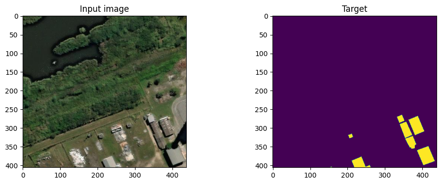
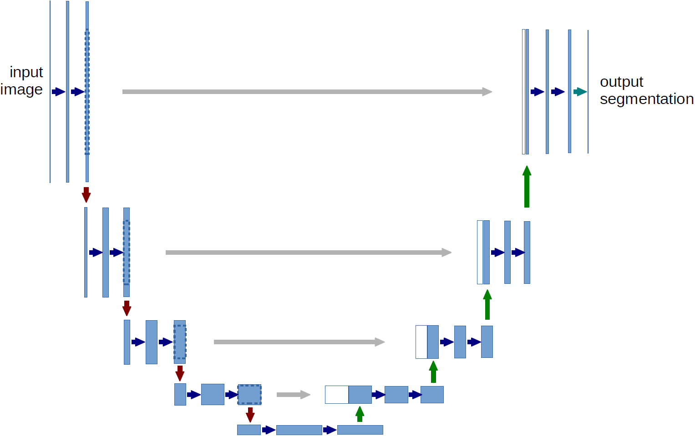
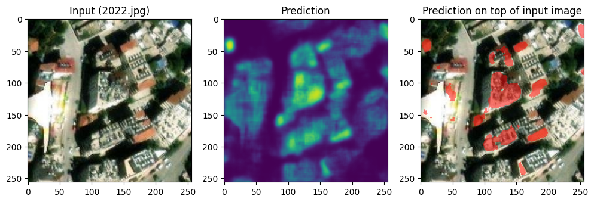
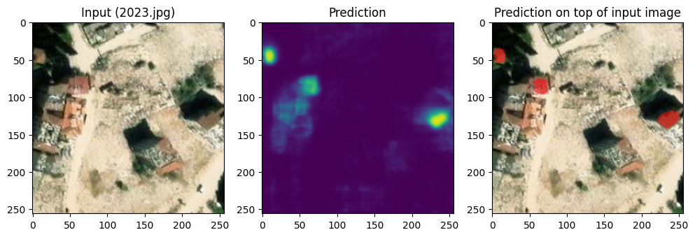
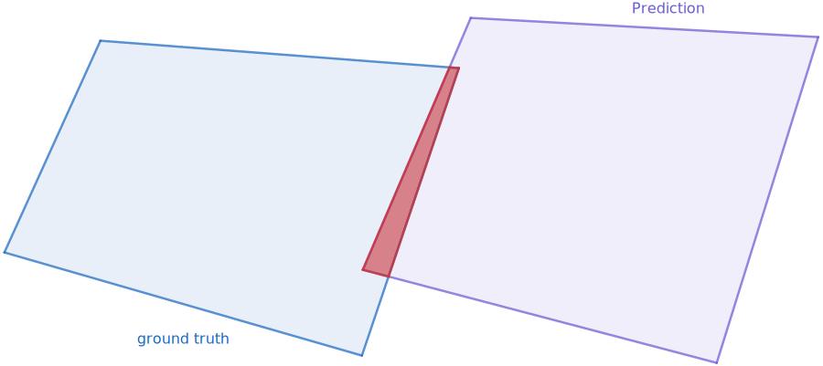
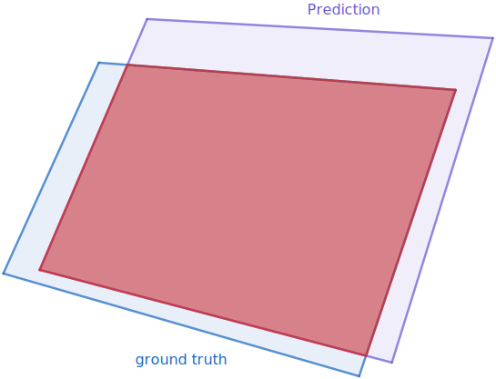

# imperial-capstore24
Predicting the Damage from Natural Disasters - a AI/ML Project for Imperial AIML Professional Certificate Capstone 2024 Cohort

# Model Card

We pick U-net as our model. Its network architecture and training details are listed below.

We also report the benchmark results for three candidate models by their accuracy, generalisability, and computation costs. We also explain why we eventually pick U-net in the end. The data used to train U-net is also described in detail.

## Model card

### Training data

The model was trained on [AOI 1 - Rio](https://spacenet.ai/spacenet-buildings-dataset-v1/) dataset. It provides the satellite images and building boundaries in Rio de Janeiro, covering 2,500+ sq. km in total. The training set has roughly 7,000 images, each of which covers an area of 200m $\times$ 200m and has a resolution of about 400px $\times$ 400px. The building boundaries are in the format of vector shapefile. One random example of the training sample is shown below.

### Model architecture

We adopt a vanilla U-net, with four downsampling encoders and four upsampling decoders (Ronneberger et al., MICCAI [2015](https://link.springer.com/chapter/10.1007/978-3-319-24574-4_28)). The downsampling is achieved with strided convolutions, and we enable skip connections between encoders and decoders.

### Inference

We illustrate the inference below. The model looks at the same geographical location in Antalya, Turkey, in year 2022 and 2023. In each year, the left panel shows the raw satellite image, the middle panel shows the probability of a pixel belonging to a building, and the right panel plots the predicted buildings in red on top of the raw input image.

## Available models

Our goal is to detect buildings from satellite images. This is not an uncommon computer vision task. There are many open sourced models available, many of which are from [SpaceNet challenges](https://spacenet.ai/spacenet-buildings-dataset-v2/). We picked three most representative models from the [challenge winners](https://github.com/SpaceNetChallenge):

1. [Random forest](https://github.com/SpaceNetChallenge/BuildingDetectors_Round2/tree/master/3-nofto)
    - at the pixel level, the model uses features like colour, brightness, position of the pixel within the image, etc. to predict whether the pixel is right on the building boundary or not
2. [U-net](https://github.com/SpaceNetChallenge/BuildingDetectors_Round2/tree/master/1-XD_XD)
   - U-net is the workhorse model for image segmentation, including medical, remote sensing, and more. The model first downsamples the input images, makes them smaller in size, and extract the most important features from them. Then it upsamples then back, using both features and the original images, to create the segmentation
3. [Multi-task Network Cascades](https://github.com/SpaceNetChallenge/BuildingDetectors/tree/master/qinhaifang)
    - it is a two-step approach. First, the model predicts a rough potential region where the building is located. In the second step, we identify the precise building outlines

## Benchmark

We find U-net is the best model in almost all perspectives, including accuracy, generalisability, and speed. However, we do notice a few biases: it struggles with small buildings.

### Accuracy

We use the same performance metric IoU (Intersection over Union) as [SpaceNet](https://github.com/SpaceNetChallenge/utilities#evaluation-metric). The intuition is straightforward: we have two shapes, the ground truth building area and our prediction. Their intersection is illustrated in red. If the prediction is bad, then intersection only takes a tiny bit of the total area. If we have an accurate prediction, then prediction and ground truth overlaps and the intersection area is almost equal to the total area. Therefore, intersection over total is a sensible metric for our task.

    

        
        
(A) bad accuracy

    

    

        
        
(B) good accuracy

    

The three models' performance is listed in the table below. The difference between them is small, with U-net outperforms other two models.

|                             | IoU   |
|-----------------------------|-------|
| Random forest               | [0.643](https://medium.com/the-downlinq/2nd-spacenet-competition-winners-code-release-c7473eea7c11) |
| U-net                       | [0.693](https://medium.com/the-downlinq/2nd-spacenet-competition-winners-code-release-c7473eea7c11) |
| Multi-task Network Cascades | [0.650](https://github.com/SpaceNetChallenge/BuildingDetectors/blob/master/qinhaifang/src/README.md) |

### Generalisability

We want to apply these open sourced model to our Turkey-Syria earthquake use case. Thus generalisability and easiness to use are important factors for us. Because we lack ground truth for Turkey buildings, we run the three models on ten random satellite images in Antalya in year 2022 and 2024, and judge the performance of them manually.

|                             | 2022 satellite image accuracy | 2024 satellite image accuracy |
|-----------------------------|-------------------------------|-------------------------------|
| Random forest               | 4 correct out of 10           | 5 correct out of 10           |
| U-net                       | 7 correct out of 10           | 9 correct out of 10           |
| Multi-task Network Cascades | 6 correct out of 10           | 6 correct out of 10           |

U-net displays a strong advantage over others.

However, during the manual check, we identify some non-trivial bias in U-net and MNC. They work reasonably well for big buildings, but almost always wrong when the buildings are small in size. Out of the four mistakes in U-net, all of them are about small buildings.

### Speed

**Inference.** In this project, we take the models as given and directly do inference. We run random forest on a i7-7800X CPU, and U-net and MNC using a RTX 3060 GPU with 16GB VRAM. Apart from model and data loading, both deep learning methods are an order of magnitude faster than the random forest, which is not surprising. GPU can do matrix multiplication in parallel while random forest can't utilise the same computing power due to its model architecture.

MNC $\approx$ U-net $\ll$ random forest

**Training.** We didn't train any model in the project. But we did run through a quick training to see how fast they are. We found it extremely hard to train the random forest: very sensitive to hyperparameters, and the loss is very unstable. MNC is slow to train, while U-net is in the middle between them.

U-net $\leq$ MNC $\ll$ random forest

